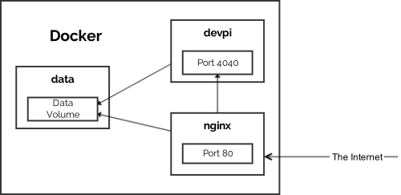

# A DevPi Docker Setup

This Docker Compose based setup runs DevPi behind Nginx.

The images are based on [Alpine Linux][0], which
enables far smaller images than Debian or the Python image.

Note that this Devpi container only works properly when being bound to port 80.
Otherwise you will need to adjust `proxy_set_header X-outside-url` in
`nginx/nginx.conf`.

## Building images

    $ docker-compose build

## Starting containers

    $ docker-compose up -d

## Recreating / updating containers

Rebuild them with ``docker-compose build``, then recreate the containers with
``docker-compose up -d``. Volumes will not be affected.

## Adding basic auth

Edit the files `nginx/auth.conf` and `nginx/htpasswd` and rebuild the containers.

## Upgrading to a new major Devpi version

To upgrade Devpi, you need to [export and re-import the data][1]. First, dump
all the data.

    $ export DUMPDIR=dump-$(date +%Y%m%d-%H%M%S)
    $ docker run --rm \
        --volumes-from=dockerdevpi_data_1 \
        -v $(pwd):/dump \
        dockerdevpi_devpi \
        devpi-server --serverdir /devpi/server --export /dump/$DUMPDIR

Now you have a folder called `dump-$timestamp` in your current directory.

Stop and recreate the devpi container:

    $ docker-compose stop devpi nginx
    $ docker-compose build devpi

Import the old server state to a different server directory:

    $ export DUMPDIR=<name-of-dump-directory>
    $ docker run --rm \
        --volumes-from=dockerdevpi_data_1 \
        -v $(pwd)/$DUMPDIR:/dump \
        dockerdevpi_devpi \
        devpi-server --serverdir /devpi/server-upgrade --import /dump

This might take a while. When it's done, do a quick test to see whether
everything worked:

    $ docker run --rm \
        -t -i \
        --volumes-from=dockerdevpi_data_1 \
        -p 80:4040 \
        dockerdevpi_devpi \
        devpi-server --host 0.0.0.0 --port 4040 --serverdir /devpi/server-upgrade

If everything on `http://localhost/` looks fine, you can press `CTRL+C` to
stop the test server and then make the upgrade permanent:

    $ docker run --rm \
        --volumes-from=dockerdevpi_data_1 \
        dockerdevpi_devpi \
        /bin/sh /devpi/upgrade.sh
    
Now re-create the entire setup:

    $ docker-compose up -d

# License

MIT License, see `LICENSE.md`.

[0]: https://hub.docker.com/_/alpine/
[1]: http://doc.devpi.net/latest/quickstart-server.html#versioning-exporting-and-importing-server-state
